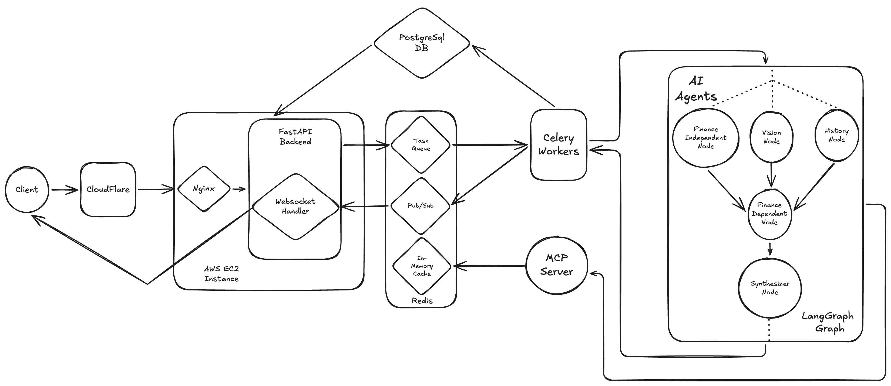

# Bargainista

Multi-agent AI system that analyzes used car listings and returns a structured recommendation — one of seven tiers from **Strong Buy** to **Strong Pass**.

**Live:** [bargainista.io](https://bargainista.io)

---

## What it does

You submit a vehicle listing — by URL, VIN, or manual entry — along with photos, mileage, asking price, and location. Three specialized AI agents run in parallel: Vision assesses the photos for damage and panel condition, History analyzes the listing text and any provided history report for red flags, and Finance computes depreciation curves, market value, and total cost of ownership. A LangGraph orchestrator fans them out concurrently, a synthesizer merges the results, and the final recommendation arrives over a live WebSocket connection while each agent's findings stream in as they complete.

---

## Architecture



---

## How it works

1. Client POSTs listing input to `/api/analyze` → receives **202 Accepted** with a `run_id`
2. Client opens a WebSocket connection to `/ws/analyze/{run_id}`
3. API enqueues a Celery task; a worker picks it up and executes the LangGraph graph
4. Three nodes fan out in parallel — Vision, History, and a Finance independent pass
5. An MCP server serves all three agents with NHTSA recall, safety rating, and VIN data; responses are cached in Redis to avoid redundant upstream calls
6. As each agent completes, the worker publishes an event to a Redis pub/sub channel keyed to `run_id`; the WebSocket handler streams it to the client immediately
7. Once the three parallel nodes finish, a Finance dependent pass adjusts repair cost totals using Vision and History outputs
8. The synthesizer averages agent scores, maps to a 7-tier recommendation, merges repair items across agents, and generates the final report
9. Final report is persisted to PostgreSQL; the WebSocket sends a `complete` event and closes

If the connection is interrupted mid-analysis, reconnecting replays completed agent results from the database before resuming the live stream.

---

## Design decisions

**Computation in Python, narrative in LLM.**
The Finance agent does all depreciation math, financing calculations, and cost projections in deterministic Python code. The LLM only generates the plain-language summary on top of those numbers. LLMs are unreliable at arithmetic — keeping computation in code makes every output auditable and reproducible.

**MCP server as the data integration boundary.**
All external vehicle data — NHTSA recalls, safety ratings, VIN decode — flows through a standalone MCP server, not inline agent code. Adding a new data source means adding a tool to the server; no agent logic or prompt changes. The server is independently runnable and can be connected directly from Claude Desktop.

**Vision agent photo first isolation.**
The Vision agent assesses photos before seeing listing text. This prevents anchoring bias — if the agent reads the seller's description before evaluating the photos, it will discount visual evidence that contradicts the seller's claims. Listing text is introduced only afterward, purely for contradiction detection.

**Subscribe-before-recheck on WebSocket connect.**
The WebSocket handler subscribes to the Redis pub/sub channel before re-querying run status from the database. This eliminates a race condition where the Celery task publishes `complete` between the DB check and the subscribe — without this ordering, a fast-completing run silently drops its final event.

**`tool_use` API for structured output enforcement.**
All agents use Anthropic's `tool_use` API to constrain LLM responses to a defined schema. This is an API-level contract, not a prompt-level request — the model cannot return a response that doesn't conform. More reliable than asking the model to "respond in JSON."

---

## Tech stack

|         Layer          |                            Technology                                   |
|------------------------|-------------------------------------------------------------------------|
| API                    | FastAPI + uvicorn                                                       |
| Task queue             | Celery 5                                                                |
| Message broker/pub-sub | Redis 7                                                                 |
| Database               | PostgreSQL 16 (asyncpg)                                                 |
| ORM                    | SQLAlchemy 2.x async                                                    |
| Schema validation      | Pydantic v2                                                             |
| Agent orchestration    | LangGraph                                                               |
| Observability          | LangSmith (LangGraph execution tracing)                                 |
| LLM                    | Anthropic Claude (Haiku for narrative, Sonnet for reasoning and vision) |
| Containerization       | Docker Compose — 6 services                                             |
| Infrastructure         | AWS EC2 t3.small, Elastic IP, Nginx reverse proxy                       |
| DNS/SSL                | Cloudflare (A record → Elastic IP, HTTPS termination)                   |

---

## Local setup

```bash
git clone https://github.com/Urus-Corsa/Bargainista.git
cd Bargainista
cp .env.example .env
# Set ANTHROPIC_API_KEY in .env — all other values have working defaults
docker compose up
```

Open [http://localhost:8000](http://localhost:8000).

The override file (`docker-compose.override.yml`) is picked up automatically and enables hot reload and direct port access for local development.

---

## Project structure

```
app/
  main.py               FastAPI entry point, lifespan, middleware
  agents/
    vision.py           Multimodal damage assessment (Claude Sonnet)
    history.py          Red flag extraction + NHTSA recall augmentation
    finance.py          Depreciation math, financing analysis, cost projection
    orchestrator.py     LangGraph StateGraph — parallel fan-out to synthesizer
    synthesizer.py      Score aggregation, repair item merging, final report
  api/
    routes.py           POST /api/analyze, GET /health
    websocket.py        /ws/analyze/{run_id} — subscribe-before-recheck pattern
    admin.py            Depreciation config CRUD (X-Admin-Key protected)
  mcp/
    vehicle_data.py     Standalone MCP server — NHTSA recalls, specs, safety ratings
    client.py           MCP client with Redis cache (24h TTL)
  models/
    schemas.py          Pydantic I/O contracts for all agents and reports
    db_models.py        SQLAlchemy ORM — AnalysisRun, AgentResult, FinalReport
  workers/
    tasks.py            Celery task — executes graph, publishes pub/sub events
    celery_app.py       Celery app config
  utils/
    ingestion.py        Input normalization — VIN decode, image base64 prep
static/
  index.html            Single page frontend (Tailwind CDN, vanilla JS)
```
